# Continuous Deployment from ML Repository to Algorithmia by Github Actions

[In our previous blog post](https://algorithmia.com/blog/from-building-an-xgboost-model-on-jupyter-notebook-to-deploying-it-on-algorithmia), we walked through:
- Building a simple XGBoost model
- Creating the inference code that runs on Algorithmia
- Pushing the inference code & requirements file and uploading the saved model file to Algorithmia

all from within the Jupyter notebook code.
  

Now in this blog post, we'll introduce our new Github Action that's capable of:
- Executing a Jupyter notebook on a Github worker machine
- Taking the model file that's saved on the worker machine and uploading it to Algorithmia
- Pushing the inference code and the requirements file to the algorithm repository
- Linking the algorithm with the newly uploaded model file 
- Triggering a new algorithm build on Algorithmia
  
through a `workflow` that's configured in an ML repository at Github.

But, let's start with our motivation for this in the first place. 

## What can you automate in your ML repo and why?

In a typical workflow, you have an ML repository at Github, where you're developing your ML models on a Jupyter notebook and you want to continuously deploy your model to Algorithmia, as you iterate on it. 

In order to have a scalable inference endpoint for your ML model, you then create an algorithm on Algorithmia. Algorithmia hosts your inference layer, ie. the algorithm in a repository, that's either backed by Github or Algorithmia as per your preference. So your algorithm has its own repository and you push your changes to this repository whenever you want to have a new build.

### Non-automated workflow

In a non-automated workflow, when you develop your ML model, you upload this model to your data collection at Algorithmia either manually, via Algorithmia's web interface; or programmatically, via its data API (TODO: Link here!)

If you don't want to override your existing model files at Algorithmia, you upload your model with a new name. With relation to this change, you also want to change your inference script to load and use this new model file in your algorithm. Or you may want to update your inference script for a different reason, regardless of your model iterations. 

So, when you make changes in your Jupyter notebook to create a new model file, you:
- Commit and push your changes in your ML repo, containing your Jupyter notebook
- Take the saved model file and upload it to Algorithmia
- Switch to your algorithm repository, update your inference script and commit and push in this repository to trigger a new algorithm build at Algorithmia

### Automated workflow
With our Github Action integrated in your Github ML repository's workflow file, you can reduce the 3 steps above into a single step. Once you commit and push your changes in your ML repo, your automation workflow can be triggered to perform the following 2 steps and automate your model file and inference code deployment to Algorithmia.

Sounds cool, right?

### Benefits of automation
Besides reducing the number of manual operations you do in different repositories, automated model deployment means your deployments are trace-able to their origins and in a better controlled manner. Some organizations require that deployments should involve multiple people's approval, as a policy and deployments should only be done through automated processes. This helps with tracing the deployments to their triggering events while also making them repeatable.

The new `model_manifest.json` file we introduce with this automation, you'd be able to see where your uploaded model came from and what was the MD5 hash of your model file at the time of this automated upload. This would give you the chance to re-calculate your model file hash in your algorithm, at inference time and make sure that your model file hasn't been tampered in between. We'll dig more into this manifest file later in this blog post!

## When is it a good fit to use this automation?

Integrating this Github Action would be a good fit for your workflow if you are either using a Jupyter notebook to train and evaluate your ML model or you're checking your saved model file into your repository at Github. 

Optionally, you may have your inference (algorithm) script & dependencies in your ML repo but this is not obligatory to benefit from this workflow. If you omit this portion, you'd still benefit from the automation by having your model file deployments automated as you iterate on your model creation notebook or your checked in model file.

## How does it work?
Whenever you do a Git push to your master branch (or any other triggering event you configure), your workflow integrating this Github Action will kick off.

- If you're developing your ML model in a Jupyter notebook, you can configure the workflow with the notebook path to execute. In this case, the Github Action will:
  - Install the required packages in your requirements.txt file on a Github worker machine
  - Run your configured Jupyter notebook file on the worker machine's from-scratch environment 
  
If not and if you have an already saved model checked-in to your repository, you can configure the workflow with the existing model file path.

In both scenarios, the Github Action will then:
- Take the ML model file from the configured path and upload it to your data collection at Algorithmia
- Copy your inference (algorithm) script to your algorithm repository
- Update/create a model_manifest.json file, connecting your inference (algorithm) code at Algorithmia with this newly uploaded model file

## What other perks does it have?
To get your inference endpoint use this newly uploaded model, the workflow will make the connection between your inference algorithm and the uploaded model file, with the key-value pairs in  `model_manifest.json` file.

In addition to that, the manifest file will contain certain metadata such as:
- Which Github repository and which ref was this model file uploaded from?
- What was the MD5 hash of your model file when it was first created?
- What is the Github commit SHA and the commit message resulting in this automated upload?
- When did this upload happen?

By using this manifest, your inference script will know which model to load and use. As we've mentioned previosly, your algorithm can also re-calculate the MD5 hash of the model file at inference time and compare it with the original MD5 hash that was calculated at the time of the upload, and make sure that the model file hasn't been changed.  

## How to configure it?

The inputs to this Github Action are listed in detail in our repository's documentation. 

As you'll notice, some inputs are required when your Algorithmia algorithm is hosted at (backed by) Github and some will be required when your Algorithmia algorithm is hosted at (backed by) Algorithmia.

You'll also notice that some of the inputs have default values, so that you're not bogged down in configuration and can start with reasonable defaults. So make sure to check out the default values first and if you want a non-default configuration for these, you can provide those values in your own ML repo's workflow file.

## How to get started with this integration?

### Algorithmia's Template ML Repository at Github
To get you started with this integration, we created a Github template repository TODO: link here containing some necessary pieces as a starter kit. You can either take this as a starting point and use the green `Use this Template` button to create your own repository off of it, or clone this repo and copy the desired files to over to your existing ML repository.

### What does the template repo come with?
Your starter kit comes with the following files to get you up to speed with this integration:

- `.github/workflows/algorithmia_deploy.yml`: Workflow definition file, containing Github Action inputs. 
- `YOUR_ALGORITHM_NAME.py`: Algorithm script, to be pushed to Algorithm repo. Should be renamed with algorithm name
- `model_training.ipynb`: Notebook file, to be optionally executed by Github Action. Can be omitted if the model file is checked-in to this repository.
- `model_manifest.json`: Glues algorithm script with the model file to use. Contains metadata about the uploaded model file. Updated on the fly by the Github Action.
- `requirements.txt`: Contains Jupyter notebook and algorithm requirements

### How to work on the template repository?

Let's walk through an example ML repository that was generated from this template. This repository is creating an XGBoost sentiment analysis model to be deployed to Algorithmia and it incorporates our Github Action to perform this deployment in an automated fashion. 

For each step below, you'll be able to jump to the related file in the repository by following the links and examine those files in more detail.

Let's walk over a typical set up, step by step:

1. Either create a new repository using our ML template repo at Github, or clone this repository and copy the files over to your existing repository. (TODO: link to template)
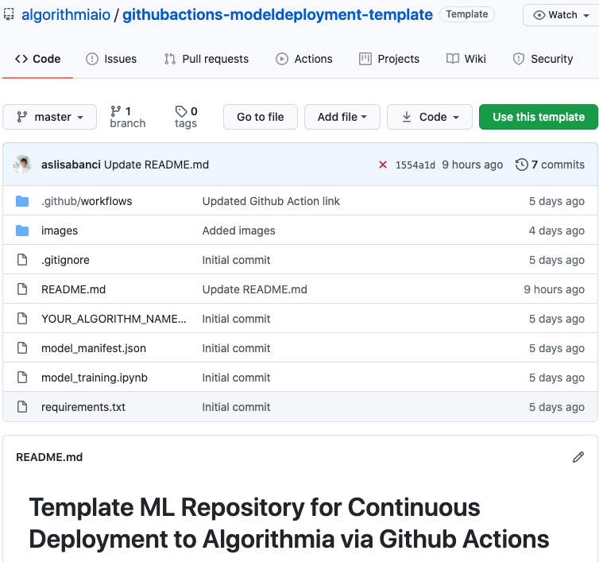

2. Go to your repository's Settings -> Secrets and input the secret variables, depending on where your algorithm repository is hosted at. 
Secrets are environment variables that are encrypted and only exposed to the actions you configure. 

- [If your ML repository is deploying to an algorithm repo backed by Github](https://github.com/algorithmiaio/githubactions-modeldeployment-demo-githubalgo/), you'd be providing the following variables:
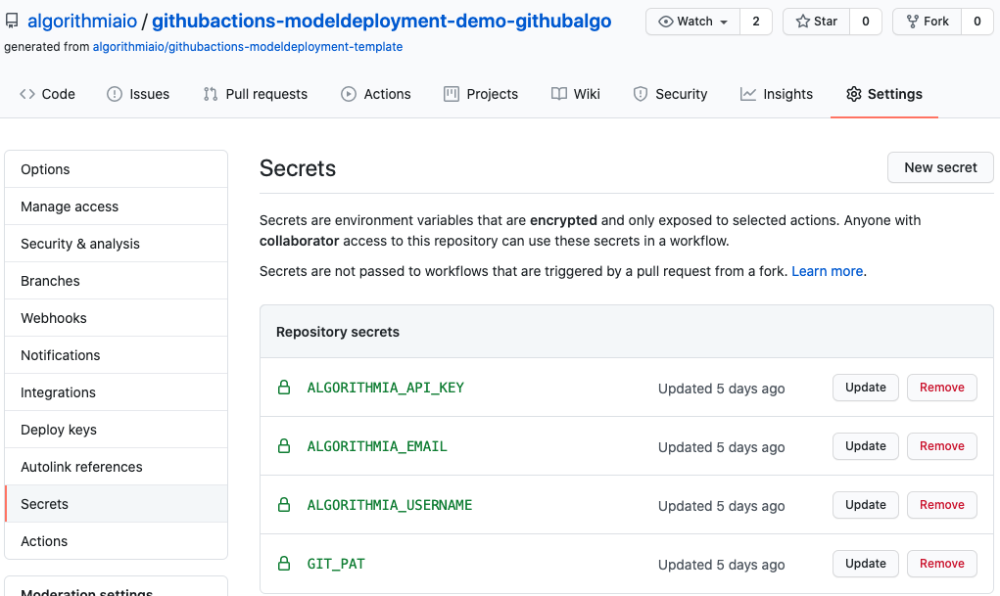

- [If your ML repository is deploying to an algorithm repo backed by Algorithmia](https://github.com/algorithmiaio/githubactions-modeldeployment-demo-algorithmiaalgo/), then you'd be providing these instead:
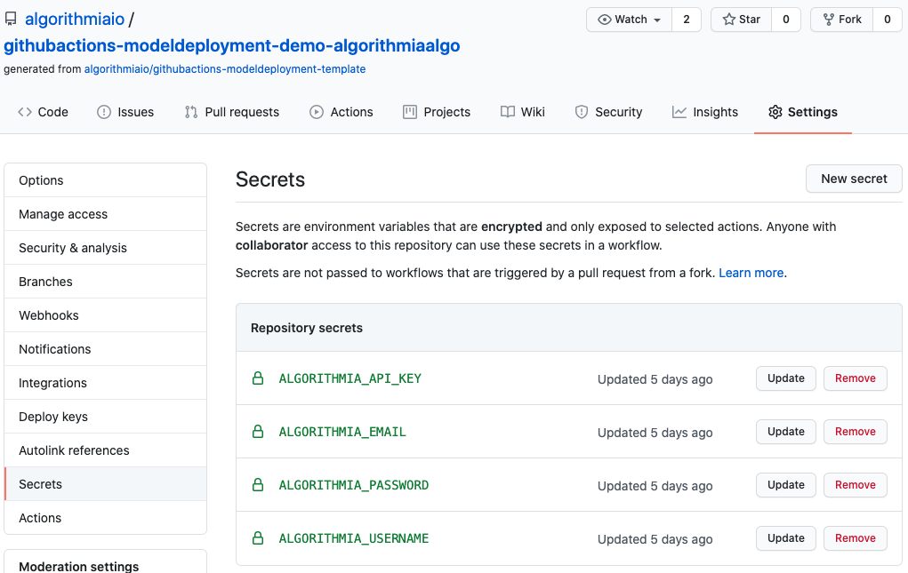
   
1. Edit the [`algorithmia_deploy.yml` file](https://github.com/algorithmiaio/githubactions-modeldeployment-demo-algorithmiaalgo/blob/master/.github/workflows/algorithmia_deploy.yml), with your algorithm's name. Remember, if you want to change the default values of the other inputs, go ahead and update them too!

2. Rename your [`YOUR_ALGORITHM_NAME.py` file](https://github.com/algorithmiaio/githubactions-modeldeployment-demo-algorithmiaalgo/blob/master/xgboost_automated.py) with your own algorithm's name. 

3. Work on your notebook and Python script files, until you're happy with your model and your inference script.
   1. Add your model training code in your notebook
   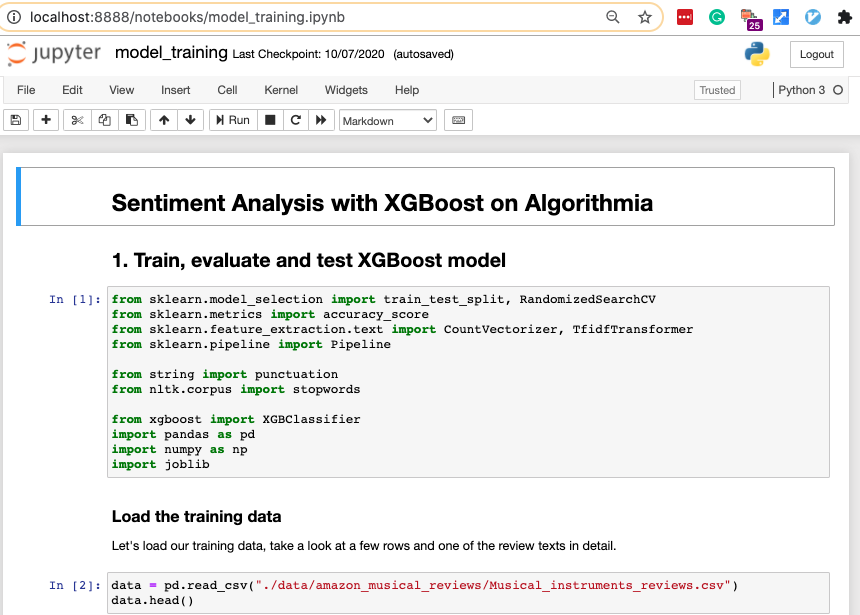
   
   2. Once you're done with your training/evaluation/tests, save your ML model object to a file on the local disk.
   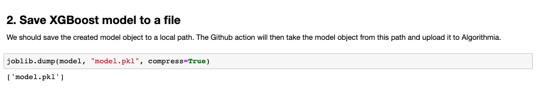

   3. Edit your inference (algorithm) script in your favorite way. In this screenshot, the algorithm Python code is edited in VS Code. 
   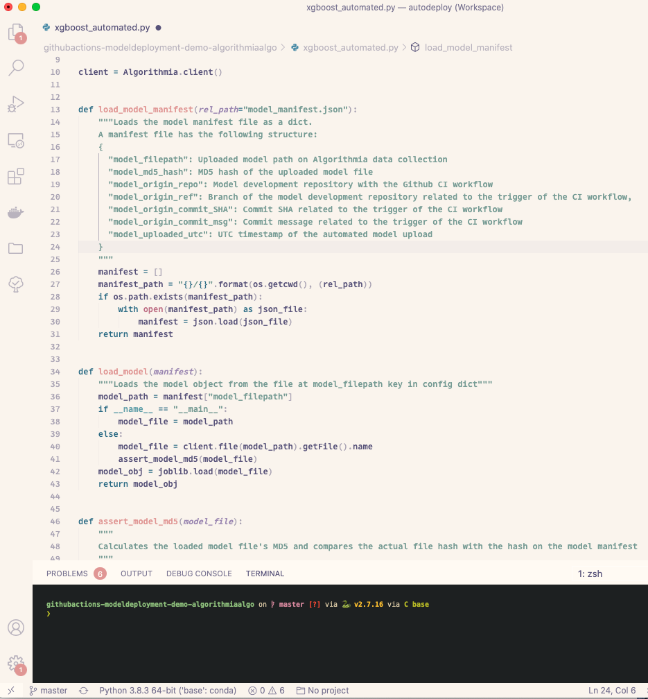

        To test your inference code locally, you can add your local execution snippets under `if __name__ == "__main__"` conditionals. These will execute when you're calling your script via the Python executable in your machine. You can see examples of this usage when you check out [the complete algorithm code](https://github.com/algorithmiaio/githubactions-modeldeployment-demo-algorithmiaalgo/blob/master/xgboost_automated.py) in our example ML repository.
   
   4. Test your inference script in your preferred way. If you don't want to leave your notebook to call and check your algorithm output, you can call your inference script with the `%run` macro, from within a cell.
   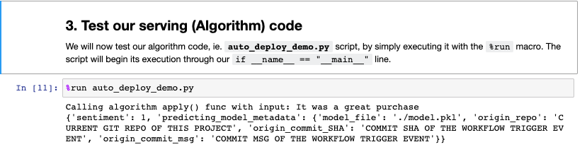

4. Edit your [requirements.txt](https://github.com/algorithmiaio/githubactions-modeldeployment-demo-algorithmiaalgo/blob/master/requirements.txt) file to contain the required packages for your notebook execution. The same requirements is going to be used for your algorithm at Algorithmia, so if you're not using the Github Action to execute your notebook through this automated workflow, make sure to still edit it if you want to push your algorithm to Algorithmia through this automation. 
     
5. Commit and push your changes or if you're working on a development/feature branch, create a PR for someone else in your organization to review and merge your changes to your master branch.

### How to check the workflow runs?

The default trigger of the automated workflow will be the `git push` event to your repository's `master` branch, unless you edited in step 2. Once the trigger event happens, you can go to the `Actions` tab of your repository and check your workflow run. 
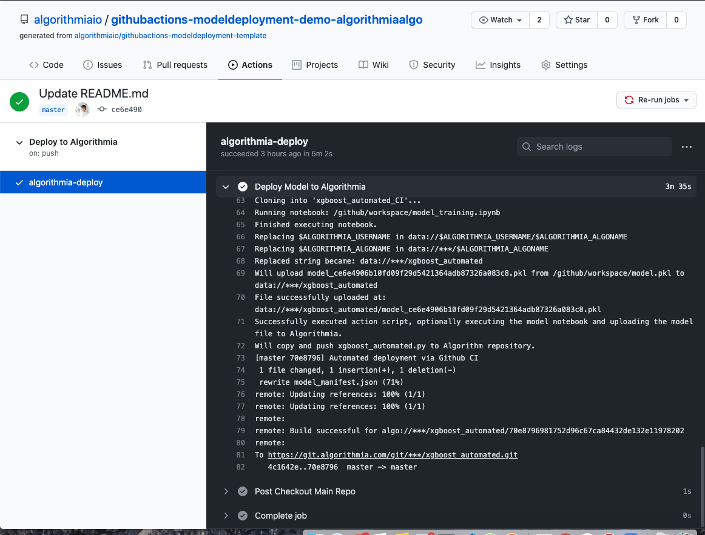

### What to expect on Algorithmia as a result?
Once the workflow run completes successfully, you should see:
1. Your model file uploaded to the configured data collection at Algorithmia. Unless you changed the default data collection path in your workflow file in step 2, your model should be uploaded to data://ALGORITHMIA_USERNAME/ALGORITHMIA_ALGONAME
   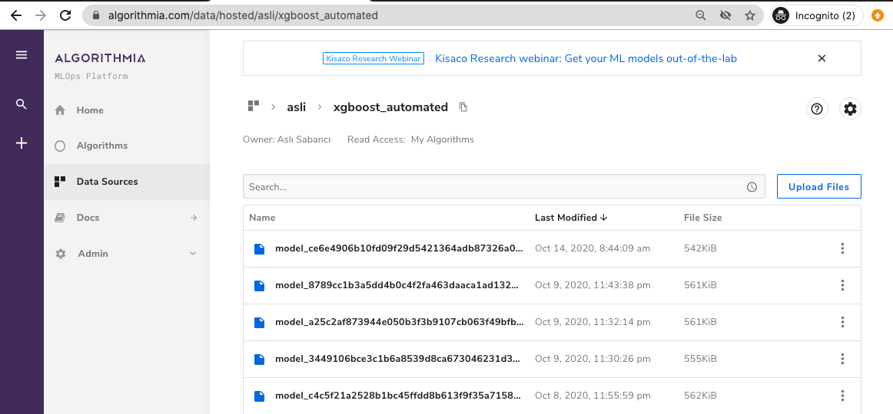

2. Your algorithm's `model_manifest.json` file updated with the information related to the origins of this automation.
   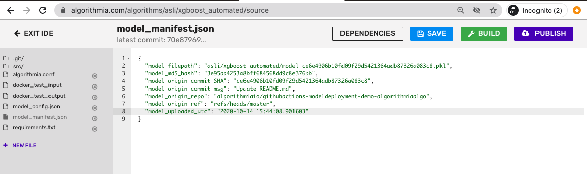

3. Your algorithm's source code updated with the edits you've made.
   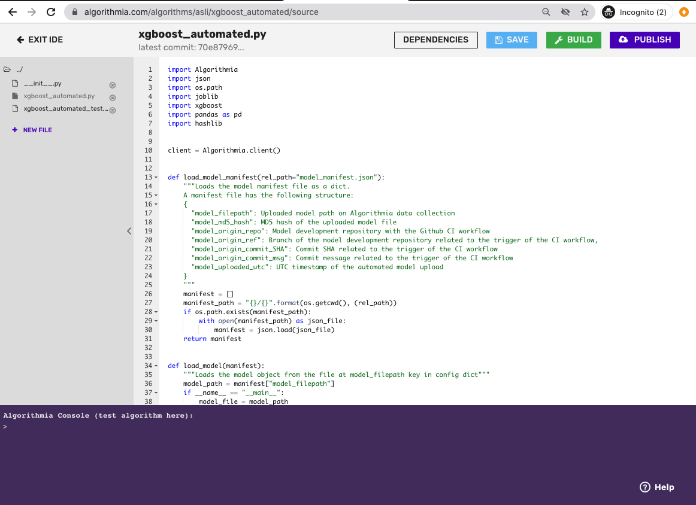

### How can this fit into mature organizations' workflow?
Some mature organizations have a separation of concerns for DevOps, Data Science and Product/Business. 

DevOps team can be the admins of the Github repositories and the Algorithmia organizations. In this case, they would be the ones setting up the ML repository generated by our template and providing the secret inputs as the workflow's environment variables afterwards. 

After the initial setup, they can hand over the repository to the Data Science / ML Engineering team, so that the team starts working on the models and the inference code. Typically, teams work on feature/development branches and do not work on the master branch of repositories. 

Once the Data Science / ML Engineering team is ready to deploy the developed model and the inference code to Algorithmia, they can ask for Product or Business team's review and approval. With the approval of these changes, the changes can be merged to the master or a prod branch, triggering the automated workflow for deployment. 

Needless to say but, this is just an example and you can tweak the triggers of your workflow as per your personal or organizational methodology.

## Now it's your turn!
Wrapping up what we've talked about in this blog post, here's a nice bundle of links to get you started:

- [Algorithmia Continuous Deployment Github Action in Github Actions marketplace](https://github.com/marketplace/actions/deploy-to-algorithmia) implementation

- [Template repository](https://github.com/algorithmiaio/githubactions-modeldeployment-template), as your starter kit
  
- [Example XGBoost model development repo](https://github.com/algorithmiaio/githubactions-modeldeployment-demo-algorithmiaalgo) generated from the template repository and using the Algorithmia Github Action to continuously deploy to [its inference (algorithm) repo backed by Algorithmia](https://algorithmia.com/algorithms/asli/xgboost_automated)
* [Example XGBoost model development repo](https://github.com/algorithmiaio/githubactions-modeldeployment-demo-githubalgo) generated from the template repository and integrating the Algorithmia Github Action to continuously deploy to [its inference (algorithm) repo backed by Github](https://algorithmia.com/algorithms/asli/xgboost_automated_github)
 
Let us know if you have any questions, comments or any feedback to improve this automation even further!